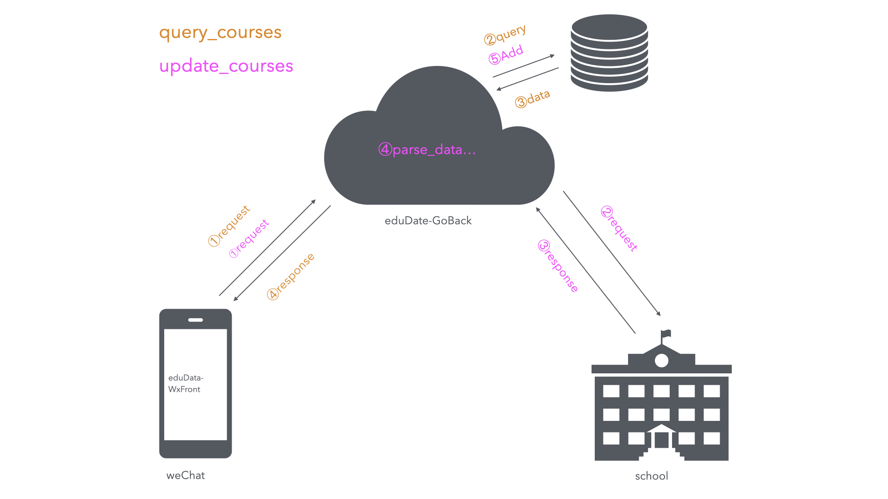

# eduData(大学教务处爬虫)

用户输入学号, 密码后, 通过js逆向来模仿真人, 来登陆到教务系统, 获取并解析课程表到数据库, 就可以通过后端api增删改查后发送给前端.

### Why open source ?
❗❗️❗️现在从教务处查课表的爬虫小程序, 只要涉及到广告等盈利手段, 那么就是违法的.

❗️❗️❗️只不过就是 __法律意识淡薄__ 或 __大学和商业组织__ 没有找到他, **铤而走险**.

❗️❗️❗️本仓库的所有内容仅供**学习**和**参考**之用, 禁止用于**任何商业用途**.

### Tech
- 语言: Go
- 数据库: Postgresql
- ORM: Gorm
- Web框架: Gin
- 前端: [微信小程序](https://github.com/huhu415/eduData-WxFront)

### Supported universities
- [x] [hrbust_哈尔滨理工大学](school/hrbust)
    - [x] 本科生
    - [x] 研究生
- [x] [neau_东北农业大学](school/neau)
    - [x] 本科生
    - [ ] 研究生
- [x] [黑龙江大学](school/hlju)
    - [x] 本科生
    - [ ] 研究生
- [ ] 东北林业大学
    - [ ] 本科生
    - [ ] 研究生
- [ ] 哈尔滨师范大学
    - [ ] 本科生
    - [ ] 研究生

### TODOs
- [x] 自定义添加课程
- [x] 日志记录的不全面
- [ ] 自定义编辑与删除课程
- [ ] 多适配不同的学校
- [ ] 增加多租户功能
- [ ] 以后有钱了, 把百度orc下了, 因为百度的需要一个月更新一次凭证, 到期后也没有提示, 就是500错误


# Develop
## Config
`Env` is higher than `Config File`

### File
```
file name: config.yaml
file content: according to the bootstrap.go Config struct
```

### Env
same as the config file, but the key is uppercase and beginning with `EDU_`
```
EDU_PG_CONFIG= xxxx
EDU_JFYM_TOKEN= xxxx
EDU_ACCESSTOKEN= xxx
```

## Develop Tips
- 以下任何一个满足, 都代表着课程信息不完整, 都在课表里显示不出来, 只能显示在下面
  - course.NumberOfLessons == 0
  - course.NumberOfLessonsLength == 0
  - course.WeekDay == 0
  - course.week == 0
